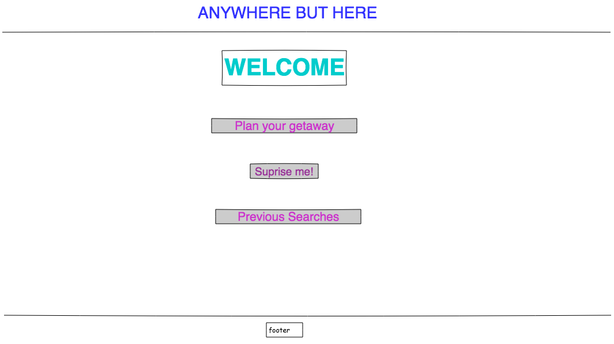
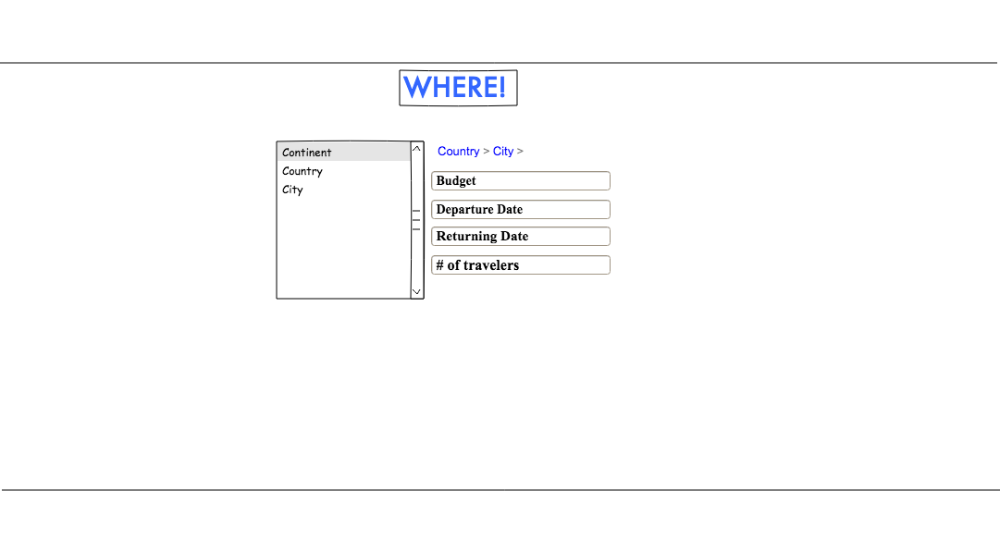

<h1>Anywhere But Here</h1>

Live Link: https://anywhere-but-here.herokuapp.com/
<br>
<br>
<b>Technologies:<b>
<br>
React
<br>
CSS
<br>
JSX
<br>
Express
<br>
PSQL
<br>
Moment.JS
<br>
Jest (for testing)
<br>
Armadeus API
<br>
<br>
<br>

Code Snippet - Fetching the API data from our Create functionality was particularly difficult

```
 componentDidMount() {
    let id = this.props.match.params.id;
    fetch(`/trips/${id}.json`).then(json =>
      json.json().then(data => {
        console.log(data);
        let date = data.departure_date.substring(0, 10);
        let trip_id = data.trip_id;
        fetch(
          `https://api.sandbox.amadeus.com/v1.2/flights/inspiration-search?apikey=LdX2udJVoFLSeSuZ04CLNkQMDICdUAvW&origin=${
            data.city_code
          }&departure_date=${date}&duration=${data.duration}&max_price=${
            data.budget
          }`
        ).then(response =>
          response.json().then(apiData => {
            console.log(apiData);
            let randomNumber = Math.floor(
              Math.random() * apiData.results.length
            );
            let destination = apiData.results[randomNumber].destination;
            let departure_date = apiData.results[randomNumber].departure_date;
            let return_date = apiData.results[randomNumber].return_date;
            let price = Math.ceil(apiData.results[randomNumber].price);
            // console.log(destination);
            // console.log(departure_date);
            // console.log(return_date);
            // console.log(Math.ceil(price));
            this.setState({
              randomNumber,
              destination,
              departure_date,
              return_date,
              price,
              trip_id
            });
            console.log(this.state.trip_id)
            // let code = this.state.destination;
            fetch(`/cities.json`).then(response =>
              response.json().then(cities => {
                this.setState({
                  cities: cities
                });
                cities.map(city => {
                  if (city.city_code === this.state.destination) {
                    return this.setState({ destination: city.city_name });
                  }
                });
              })
            );
          })
        );
      })
    );
  }
```
<br>
User Stories:
<br>
<br>
New Trip Page: As a user I want to be able to create a new trip under a specific budget
<br>
<br>
See All Page: As a user I want to be able to see previous searches
<br>
<br>
Edit Page: As a user I want to be able to update a trip budget or information to reflect my current needs
<br>
<br>
Delete Functionality: As a user I want to be able to delete a trip if I no longer need it/if it is no longer available
<br>
<br>
<br>
<br>
We feel this project would be especially useful to students or anyone trying to get away while on a budget. Some issues we ran into involved actually fetching the 3rd Party API data and implementing delete functonality. In the future we would like to add ecommerce and customer service chat.
<br> <br> <br>

Wireframes
<br>

Welcome Page:

<br>

Create:

<br>

Edit:

<br>

Update:

<br>

Show All:


